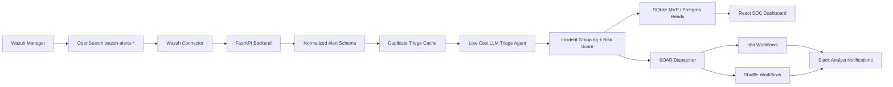

# NetraShield MVP

Low-cost SOC noise-reduction and automation layer for Wazuh-first deployments, designed to become SIEM-agnostic.

## MVP Goal

Convert noisy SIEM alerts into prioritized, explainable incidents and trigger analyst-approved SOAR workflows through open-source automation.

## Current Build Status

- Day 1: Complete - market strategy, pain-point research, competitor scan, and MVP narrowing.
- Day 2: Complete - product plan plus backend foundation (DB/session, auth, JWT, RBAC, admin APIs, audit logs).
- Day 3: Complete - connector layer with persisted configs, health checks, encrypted secret path, connector history/audit, and live Wazuh/OpenSearch probe validation.
- Day 4: In progress - AI triage depth, analyst feedback, incident lifecycle, AI model settings, and threat-intel provider control plane.
- Day 5: In progress - alert queue filters, persisted correlation groups, local IOC enrichment, case lifecycle sections, executive metrics, and measurable noise-reduction evidence.
- Day 6: Demo-ready - n8n SOAR connector state, workflow template API, trigger API, persisted workflow run logs, frontend request console, and first high-impact approval hold.
- Day 7: Demo pack added - demo runbook, screenshot capture script, browser walkthrough, RBAC role editing, and judge-ready evidence checklist.

## Core Flow

1. Ingest Wazuh/OpenSearch alerts.
2. Normalize alerts into a SIEM-agnostic schema.
3. Enrich with asset, identity, threat intel, MITRE, and history context.
4. Use an LLM triage agent to classify and summarize.
5. Group related alerts into incidents.
6. Show analyst-ready context in the UI.
7. Trigger n8n/Shuffle workflows with approval and audit logging.

## High-Level Architecture Flow



### Architecture Principles

- Wazuh is the first connector, not a permanent dependency.
- Core logic consumes normalized alerts so Splunk, Sentinel, Elastic, QRadar, or EDR sources can be added later.
- AI triage returns structured JSON with verdict, confidence, evidence, risk score, and recommended actions.
- Repeated alerts should use cached triage to reduce token usage.
- Current SOAR foundation records workflow runs and audit events. Analyst-requested containment workflows are held as pending approval before destructive response actions.

## Cyber Authorization Boundaries

This project is defensive SOC tooling. The following activities require explicit owner approval before use on a live environment:

- Connecting to a production SIEM, Wazuh manager, OpenSearch cluster, or EDR source.
- Pulling, storing, exporting, or sharing real security logs and alert evidence.
- Sending client IOCs, hostnames, usernames, hashes, URLs, or IPs to external threat-intel or LLM providers.
- Triggering SOAR actions that change systems, such as blocking IPs, disabling users, isolating hosts, deleting files, or changing firewall rules.
- Running automation against third-party tools such as Jira, Slack, email, ticketing queues, n8n, Shuffle, or cloud APIs.

The default MVP design keeps dangerous actions behind RBAC, audit logs, masked secrets, and planned human approval gates.

## Repository Layout

```text
backend/          FastAPI backend
frontend/         React dashboard
codex-skills/     Project-specific Codex skills
data/             Demo Wazuh alerts and fixtures
docs/             Architecture and build notes
site/             7-day MVP progress website
soar/             n8n and Shuffle workflow templates
```

## Day 2 Planning Artifacts

- `docs/DAY2_PRODUCT_PLAN.md`: product wedge, target users, MVP boundaries, success metrics, and Day 3 readiness checklist.
- `docs/TECH_STACK.md`: low-cost stack choices and replaceability rules.
- `docs/BUILD_SEQUENCE.md`: day-wise implementation sequence from Wazuh ingestion to demo polish.
- `docs/CODEX_SKILLS.md`: project-local skill map for architecture, Wazuh, LLM triage, SOAR, and security.
- `GET /mvp/status`: backend endpoint that reports Day 2 completion and the next Day 3 build target.

## Day 3 Wazuh Pipeline Endpoints

- `GET /alerts/sample`: returns normalized demo Wazuh alerts plus summary counts.
- `GET /alerts/normalized`: returns normalized alert objects with pagination and SOC filters.
- `GET /api/v1/alerts`: returns persisted alerts with `limit`, `offset`, severity, rule, host, source IP, user, MITRE, and search filters.
- `POST /alerts/normalize`: converts one raw Wazuh alert into the normalized schema.
- `GET /alerts/wazuh/recent`: fetches recent alerts from OpenSearch when credentials are configured.

## Day 4 AI Triage Endpoints

- `POST /triage/alert`: triages one normalized alert and returns structured JSON.
- `GET /triage/sample`: triages all sample normalized alerts in batch mode.
- `GET /triage/noise-reduction`: returns raw alert count, suppressed noise, grouped duplicates, analyst item count, and reduction percentage.

## Day 4-5 Control Plane Endpoints

- `GET /api/v1/settings/ai-providers`: lists OpenAI, Anthropic, Ollama, and offline heuristic model settings with masked secrets.
- `PUT /api/v1/settings/ai-providers/{provider}`: admin-only update for model, cache, token limits, severity threshold, base URL, and API key.
- `POST /api/v1/settings/ai-providers/{provider}/health`: validates whether a provider is configured without exposing the secret.
- `GET /api/v1/settings/threat-intel`: lists VirusTotal, AbuseIPDB, OTX, MISP, and local IOC settings with masked secrets.
- `PUT /api/v1/settings/threat-intel/{provider}`: admin-only update for API key, base URL, daily limit, and enrichment cache TTL.
- `POST /api/v1/settings/threat-intel/{provider}/health`: validates threat-intel configuration state.
- `GET /api/v1/threat-intel/local-iocs`: lists lab-local IOC watchlist entries.
- `POST /api/v1/threat-intel/local-iocs`: creates or updates a local IOC.
- `GET /api/v1/threat-intel/enrich-alert/{alert_id}`: matches a stored alert against local IOCs without external API calls.

## Day 6-7 SOAR, Demo, and Admin Controls

- `GET /api/v1/automation/connectors`: returns n8n connector status and masked webhook state.
- `GET /api/v1/automation/workflow-templates`: lists available workflow templates.
- `POST /api/v1/automation/workflow-templates/{template_id}/trigger`: requests a workflow run with case and alert context.
- `GET /api/v1/automation/workflow-runs`: shows persisted workflow history, including pending approvals.
- `POST /api/v1/automation/workflow-runs/{run_id}/approval`: admin approval/reject path for high-impact workflow requests.
- `PATCH /api/v1/auth/users/{user_id}/role`: admin-only role assignment for `admin`, `analyst`, or `viewer`, with self-demotion blocked.
- Demo runbook: `docs/DAY7_DEMO_RUNBOOK.md`.
- Browser walkthrough: `demo/video/demo-flow.html`.
- Screenshot capture script: `scripts/capture_demo_screenshots.mjs`.
- Importable n8n workflow: `soar/n8n/netrashield-soar-action.workflow.json`.

## 7-Day Build Plan

- Day 1: Market strategy, competitor/product scan, industry pain-point research, startup positioning, and focused MVP idea selection.
- Day 2: Product plan, high-level architecture, technology stack, Codex skills, repository setup, and build sequence.
- Day 3: Wazuh deployment path, OpenSearch connectivity, sample alert fetch, normalization/fine-tuning, and MVP dashboard alert display.
- Day 4: AI triage endpoints with signal/noise scoring, correlation, queue routing, suppression reason, confidence, evidence, MITRE context, risk scoring, cache replay, and BYO model settings.
- Day 5: Incident grouping, threat-intel enrichment, risk scoring aggregation, duplicate/noise feedback, and measurable alert-reduction metrics.
- Day 6: n8n/Shuffle SOAR workflow triggers, Slack notifications, approval controls, and analyst UI.
- Day 7: Demo polish, security review, before/after pitch metrics, dashboard screenshots, RBAC role editing, walkthrough flow, and judge-ready story.

## Low-Cost AI Strategy

The MVP uses a Cheap Cloud strategy instead of fine-tuning. The default path is
a small useful cloud model, strict input size, JSON-only output, cached duplicate
triage, and fallback escalation for unclear alerts. Stronger models should be
reserved only for demo-critical or high-severity summaries when required.

## Development

Use the steps below when cloning NetraShield onto the same lab server where
Wazuh and n8n are running.

### Single-Server Lab Ports

| Component | Default port | Purpose |
| --- | ---: | --- |
| Wazuh Dashboard | 443 or 8443 | Wazuh web console |
| Wazuh API | 55000 | Manager status, agents, and API health |
| Wazuh Indexer / OpenSearch | 9200 | `wazuh-alerts-*` alert search |
| NetraShield backend | 8000 | FastAPI API, auth, triage, connectors, SOAR |
| NetraShield frontend | 5174 | React SOC dashboard |
| n8n | 5679 -> 5678 | SOAR workflow editor and webhook runtime |

For a public demo, allow only the ports you need from your IP address. For
production, place the frontend, API, and n8n behind HTTPS and a reverse proxy.

### Prerequisites

- Ubuntu/Debian server with Wazuh all-in-one already installed and healthy.
- Python 3.11 or newer.
- Node.js 18 or 20 with npm.
- Git.
- Docker if n8n will run as a container.
- Access to Wazuh API credentials and OpenSearch credentials.

Install common packages on Ubuntu/Debian:

```bash
sudo apt update
sudo apt install -y git python3 python3-venv python3-pip nodejs npm docker.io jq curl
sudo systemctl enable --now docker
```

If `node -v` is older than Node 18, install Node 20 from NodeSource or your
preferred package manager before running the frontend.

### Clone The Repository

```bash
git clone https://github.com/cybermukesh/ai-soc-soar-mvp.git
cd ai-soc-soar-mvp
```

### Configure Backend Environment

Create the backend runtime environment file:

```bash
cp .env.example .env
```

Edit `.env` and use your own secrets:

```bash
APP_ENV=development
API_HOST=0.0.0.0
API_PORT=8000
JWT_SECRET=<generate-a-long-random-secret>
DB_URL=sqlite:///data/runtime/mvp_auth.db

WAZUH_API_URL=https://<wazuh-server-ip>:55000
WAZUH_API_USER=wazuh-wui
WAZUH_API_PASSWORD=<wazuh-api-password>

OPENSEARCH_URL=https://<wazuh-server-ip>:9200
OPENSEARCH_USER=readall
OPENSEARCH_PASSWORD=<opensearch-password>
OPENSEARCH_ALERT_INDEX=wazuh-alerts-*

N8N_WEBHOOK_URL=http://<wazuh-server-ip>:5679/webhook/netrashield-soar-action

LLM_PROVIDER=openai
LLM_MODEL=gpt-4o-mini
LLM_MAX_INPUT_CHARS=6000
LLM_MAX_OUTPUT_TOKENS=700
LLM_CACHE_ENABLED=true
LLM_TRIAGE_ONLY_MIN_SEVERITY=medium
OPENAI_API_KEY=<optional-openai-key>
ANTHROPIC_API_KEY=
OLLAMA_BASE_URL=http://localhost:11434

VIRUSTOTAL_API_KEY=<optional-virustotal-key>
VIRUSTOTAL_BASE_URL=https://www.virustotal.com/api/v3
ABUSEIPDB_API_KEY=<optional-abuseipdb-key>
ABUSEIPDB_BASE_URL=https://api.abuseipdb.com/api/v2
OTX_API_KEY=<optional-otx-key>
OTX_BASE_URL=https://otx.alienvault.com/api/v1
MISP_API_KEY=<optional-misp-key>
MISP_BASE_URL=<optional-misp-url>
```

Do not commit `.env`. It is intentionally ignored by Git.

For OpenSearch, `readall` is enough for alert fetch in the MVP. It may not be
allowed to call `_cluster/health`, so NetraShield also validates access by
querying the alert index. Use `admin` only if you need full cluster-health
checks.

### Find Wazuh And OpenSearch Credentials

Check the Wazuh dashboard API user:

```bash
sudo cat /usr/share/wazuh-dashboard/data/wazuh/config/wazuh.yml
```

Test Wazuh API authentication:

```bash
TOKEN=$(curl -sk -u '<wazuh-api-user>:<wazuh-api-password>' \
  'https://127.0.0.1:55000/security/user/authenticate?raw=true')

echo "TOKEN_LEN=${#TOKEN}"

curl -sk -H "Authorization: Bearer $TOKEN" \
  'https://127.0.0.1:55000/manager/status?pretty=true'
```

If you kept the Wazuh installer archive, extract the generated password file:

```bash
tar -O -xvf wazuh-install-files.tar wazuh-install-files/wazuh-passwords.txt
```

If passwords were rotated with the Wazuh password tool, review the output and
update `.env`, Wazuh dashboard, and Filebeat as required by Wazuh.

### Start The Backend

```bash
python3 -m venv backend/.venv
source backend/.venv/bin/activate
pip install --upgrade pip
pip install -e backend
python3 -m uvicorn app.main:app --host 0.0.0.0 --port 8000 --app-dir backend
```

Backend health check:

```bash
curl -s http://127.0.0.1:8000/health
```

Default seeded login for the MVP lab:

```text
Email: admin@aisocmvp.com
Password: admin123
```

Change the default password before using the tool outside a local demo.

### Start The Frontend

Create the frontend environment file:

```bash
cd frontend
cp .env.example .env
```

For local browser access on the same machine:

```bash
VITE_API_BASE_URL=http://127.0.0.1:8000
```

For browser access from another laptop or public demo machine:

```bash
VITE_API_BASE_URL=http://<server-ip>:8000
```

Run the React dashboard:

```bash
npm install
npm run dev -- --host 0.0.0.0 --port 5174
```

Open:

```text
http://<server-ip>:5174
```

### Start n8n For SOAR

Run n8n on host port `5679` so it does not conflict with NetraShield or Wazuh:

```bash
docker volume create n8n_data
docker rm -f n8n 2>/dev/null || true

docker run -d --name n8n --restart unless-stopped \
  -p 0.0.0.0:5679:5678 \
  -e N8N_HOST=<server-ip> \
  -e N8N_PORT=5678 \
  -e N8N_PROTOCOL=http \
  -e N8N_SECURE_COOKIE=false \
  -e WEBHOOK_URL=http://<server-ip>:5679/ \
  -v n8n_data:/home/node/.n8n \
  n8nio/n8n:latest
```

`N8N_SECURE_COOKIE=false` is acceptable for the lab HTTP demo only. For
production, use HTTPS and remove this setting.

Open n8n:

```text
http://<server-ip>:5679
```

Create the n8n owner account, then import and activate:

```text
soar/n8n/netrashield-soar-action.workflow.json
```

Smoke-test the n8n webhook:

```bash
curl -s -X POST "http://<server-ip>:5679/webhook/netrashield-soar-action" \
  -H 'Content-Type: application/json' \
  -d '{"incident_id":"demo-case-1","alert_id":"demo-alert-1","dry_run":true,"payload":{"requested_workflow":"notify"}}' \
  | python3 -m json.tool
```

Expected result includes `"status": "accepted"`.

### Verify NetraShield Connectors

Get a NetraShield API token:

```bash
APP_TOKEN=$(curl -s -X POST 'http://127.0.0.1:8000/api/v1/auth/login' \
  -H 'Content-Type: application/json' \
  -d '{"email":"admin@aisocmvp.com","password":"admin123"}' \
  | python3 -c 'import sys,json; print(json.load(sys.stdin)["access_token"])')

echo "APP_TOKEN_LEN=${#APP_TOKEN}"
```

Check Wazuh and OpenSearch from NetraShield:

```bash
curl -s -H "Authorization: Bearer $APP_TOKEN" \
  'http://127.0.0.1:8000/api/v1/connectors/wazuh/health' \
  | python3 -m json.tool

curl -s -H "Authorization: Bearer $APP_TOKEN" \
  'http://127.0.0.1:8000/api/v1/connectors/opensearch/health' \
  | python3 -m json.tool
```

Fetch live Wazuh alerts through OpenSearch:

```bash
curl -s -H "Authorization: Bearer $APP_TOKEN" \
  'http://127.0.0.1:8000/alerts/wazuh/recent?limit=3' \
  | python3 -m json.tool
```

Sync alerts into the persistent NetraShield database and run triage:

```bash
curl -s -X POST -H "Authorization: Bearer $APP_TOKEN" \
  'http://127.0.0.1:8000/api/v1/ingestion/wazuh/sync?limit=10&triage=true' \
  | python3 -m json.tool
```

Trigger n8n through NetraShield:

```bash
curl -s -X POST \
  -H "Authorization: Bearer $APP_TOKEN" \
  -H 'Content-Type: application/json' \
  'http://127.0.0.1:8000/api/v1/automation/workflow-templates/n8n-test-webhook/trigger' \
  -d '{"incident_id":"demo-case-1","alert_id":"demo-alert-1","dry_run":true,"payload":{"requested_workflow":"notify"}}' \
  | python3 -m json.tool
```

### Configure Threat Intel Providers

Threat-intel secrets can be configured in either place:

- NetraShield UI: `AI & Intel` -> `Threat Intel`.
- Server `.env`: `VIRUSTOTAL_API_KEY`, `ABUSEIPDB_API_KEY`, `OTX_API_KEY`,
  `MISP_API_KEY`, and `MISP_BASE_URL`.

The enrichment endpoint uses enabled provider settings from the database and
keeps secrets masked in the UI. External lookups send only public IPs, public
domains, URLs, and hashes. Private IPs, usernames, and internal hostnames remain
local.

After saving provider keys, enrich a stored alert:

```bash
curl -s -H "Authorization: Bearer $APP_TOKEN" \
  'http://127.0.0.1:8000/api/v1/threat-intel/enrich-alert/<alert-id>' \
  | python3 -m json.tool
```

Expected result includes `local_ioc`, `providers`, `external_match_count`,
`max_external_score`, and `privacy_guardrail`.

### Optional Firewall Rules

For a quick lab, open only the required ports:

```bash
sudo ufw allow 8000/tcp
sudo ufw allow 5174/tcp
sudo ufw allow 5679/tcp
sudo ufw reload
```

On a VPS, also check the cloud firewall/security group.

### Troubleshooting

**Frontend opens but API calls fail**

The frontend uses `VITE_API_BASE_URL`. If you open the UI from another machine
and it is still set to `http://localhost:8000`, the browser will call the
viewer laptop instead of the server. Set `frontend/.env` to:

```bash
VITE_API_BASE_URL=http://<server-ip>:8000
```

Then restart the frontend dev server.

**Firefox shows `SSL_ERROR_RX_RECORD_TOO_LONG` for n8n**

You are opening HTTP n8n with HTTPS. Use:

```text
http://<server-ip>:5679
```

For the lab HTTP setup, keep `N8N_SECURE_COOKIE=false`. For production, put n8n
behind HTTPS.

**n8n port is published but browser cannot connect**

Check the container, logs, listener, and firewall:

```bash
docker ps --filter name=n8n
docker logs --tail 80 n8n
sudo ss -lntp | grep -E '5678|5679'
curl -I http://127.0.0.1:5679
curl -I http://<server-ip>:5679
sudo ufw status
```

**n8n webhook returns 404**

Activate the imported workflow and use the production webhook path:

```text
/webhook/netrashield-soar-action
```

The test URL shown inside n8n is different from the production webhook URL.

**Wazuh API returns unauthorized**

Generate a token directly against Wazuh first:

```bash
TOKEN=$(curl -sk -u '<wazuh-api-user>:<wazuh-api-password>' \
  'https://127.0.0.1:55000/security/user/authenticate?raw=true')
echo "TOKEN_LEN=${#TOKEN}"
```

If the token length is empty or the manager status call fails, update the Wazuh
API user/password in `.env`.

**OpenSearch returns 401**

The OpenSearch username/password is wrong or has changed. Re-check the Wazuh
password output and update `OPENSEARCH_USER` and `OPENSEARCH_PASSWORD`.

**OpenSearch cluster health returns 403**

This is normal for low-privilege users like `readall`. NetraShield can still
fetch alerts if the user can read `wazuh-alerts-*`. Use `admin` only if the
demo requires full cluster-health checks.

**No live alerts appear**

Confirm Wazuh is indexing alerts:

```bash
curl -sk -u '<opensearch-user>:<opensearch-password>' \
  'https://127.0.0.1:9200/wazuh-alerts-*/_search?size=1&pretty'
```

Then run the NetraShield sync endpoint again with `triage=true`.

**Database appears empty after restart**

The MVP uses a local SQLite database by default. Do not delete files under
`data/runtime/`. For production, move to Postgres and set the database URL in
the backend environment.

### Security Notes

- Rotate any Wazuh, OpenSearch, n8n, or LLM secrets that were pasted into chat,
  logs, screenshots, or terminal history.
- Keep `.env` out of Git.
- Use least-privilege OpenSearch users for alert fetch.
- Keep destructive SOAR actions behind RBAC and approval.
- Use HTTPS before exposing the demo to anyone beyond the lab.
