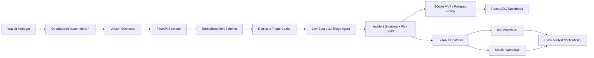

# AI SOC SOAR MVP

Low-cost AI SOC automation layer for Wazuh-first deployments, designed to become SIEM-agnostic.

## MVP Goal

Convert noisy SIEM alerts into prioritized, explainable incidents and trigger analyst-approved SOAR workflows through open-source automation.

## Current Build Status

- Day 1: Complete - market strategy, pain-point research, competitor scan, and MVP narrowing.
- Day 2: Complete - product plan, architecture, stack, Codex skills, build sequence, and repo setup.
- Day 3: Next - Wazuh deployment, Wazuh API/OpenSearch connection, alert fetch, normalization, and dashboard display.

## Core Flow

1. Ingest Wazuh/OpenSearch alerts.
2. Normalize alerts into a SIEM-agnostic schema.
3. Enrich with asset, identity, threat intel, MITRE, and history context.
4. Use a low-cost LLM triage agent to classify and summarize.
5. Group related alerts into incidents.
6. Show analyst-ready context in the UI.
7. Trigger n8n/Shuffle workflows with approval and audit logging.

## High-Level Architecture Flow



## Architecture Principles

- Wazuh is the first connector, not a permanent dependency.
- Core logic consumes normalized alerts so Splunk, Sentinel, Elastic, QRadar, or EDR sources can be added later.
- AI triage returns structured JSON with verdict, confidence, evidence, risk score, and recommended actions.
- Repeated alerts should use cached triage to reduce token usage.
- SOAR actions are approval-gated in the MVP and recorded in an audit trail.

## Repository Layout

```text
backend/          FastAPI backend
frontend/         React dashboard
codex-skills/     Project-specific Codex skills
data/             Demo Wazuh alerts and fixtures
docs/             Architecture and build notes
site/             7-day MVP progress website
soar/             n8n and Shuffle workflow templates
```

## Day 2 Planning Artifacts

- `docs/DAY2_PRODUCT_PLAN.md`: product wedge, target users, MVP boundaries, success metrics, and Day 3 readiness checklist.
- `docs/TECH_STACK.md`: low-cost stack choices and replaceability rules.
- `docs/BUILD_SEQUENCE.md`: day-wise implementation sequence from Wazuh ingestion to demo polish.
- `docs/CODEX_SKILLS.md`: project-local skill map for architecture, Wazuh, LLM triage, SOAR, and security.

## 7-Day Build Plan

- Day 1: Market strategy, competitor/product scan, industry pain-point research, startup positioning, and focused MVP idea selection.
- Day 2: Product plan, high-level architecture, technology stack, Codex skills, repository setup, and build sequence.
- Day 3: Wazuh deployment, Wazuh API/OpenSearch connectivity, alert fetch, normalization/fine-tuning, and MVP dashboard alert display.
- Day 4: AI triage agent with compact prompts, structured JSON output, confidence, evidence, MITRE context, and audit records.
- Day 5: Incident grouping, risk scoring, duplicate/noise feedback, and measurable alert-reduction metrics.
- Day 6: n8n/Shuffle SOAR workflow triggers, Slack notifications, approval controls, and analyst UI.
- Day 7: Demo polish, security review, before/after pitch metrics, dashboard screenshots, and judge-ready story.

## Low-Cost AI Strategy

The MVP uses a Cheap Cloud strategy instead of fine-tuning. The default path is a small useful cloud model, strict input size, JSON-only output, cached duplicate triage, and fallback escalation for unclear alerts. Stronger models should be reserved only for demo-critical or high-severity summaries when required.
