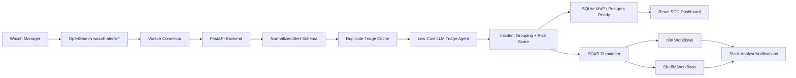

# AI SOC SOAR MVP

Low-cost AI SOC automation layer for Wazuh-first deployments, designed to become SIEM-agnostic.

## MVP Goal

Convert noisy SIEM alerts into prioritized, explainable incidents and trigger analyst-approved SOAR workflows through open-source automation.

## Current Build Status

- Day 1: Complete - market strategy, pain-point research, competitor scan, and MVP narrowing.
- Day 2: Complete - product plan, architecture, stack, Codex skills, build sequence, and repo setup.
- Day 3: Complete - Wazuh sample fixtures, OpenSearch-ready connector, alert normalization API, and dashboard preview.
- Day 4: Next - low-token AI triage verdicts, confidence, evidence, MITRE context, and recommendations.

## Core Flow

1. Ingest Wazuh/OpenSearch alerts.
2. Normalize alerts into a SIEM-agnostic schema.
3. Enrich with asset, identity, threat intel, MITRE, and history context.
4. Use a low-cost LLM triage agent to classify and summarize.
5. Group related alerts into incidents.
6. Show analyst-ready context in the UI.
7. Trigger n8n/Shuffle workflows with approval and audit logging.

## High-Level Architecture Flow



## Day 3 Wazuh Pipeline Endpoints

- `GET /alerts/sample`: returns normalized demo Wazuh alerts plus summary counts.
- `GET /alerts/normalized`: returns normalized alert objects for dashboard rendering.
- `POST /alerts/normalize`: converts one raw Wazuh alert into the normalized schema.
- `GET /alerts/wazuh/recent`: fetches recent alerts from OpenSearch when credentials are configured.

## Repository Layout

```text
backend/          FastAPI backend
frontend/         React dashboard
codex-skills/     Project-specific Codex skills
data/             Demo Wazuh alerts and fixtures
docs/             Architecture and build notes
site/             7-day MVP progress website
soar/             n8n and Shuffle workflow templates
```

## 7-Day Build Plan

- Day 1: Market strategy, competitor/product scan, industry pain-point research, startup positioning, and focused MVP idea selection.
- Day 2: Product plan, high-level architecture, technology stack, Codex skills, repository setup, and build sequence.
- Day 3: Wazuh deployment path, OpenSearch connectivity, sample alert fetch, normalization/fine-tuning, and MVP dashboard alert display.
- Day 4: AI triage agent with compact prompts, structured JSON output, confidence, evidence, MITRE context, and audit records.
- Day 5: Incident grouping, risk scoring, duplicate/noise feedback, and measurable alert-reduction metrics.
- Day 6: n8n/Shuffle SOAR workflow triggers, Slack notifications, approval controls, and analyst UI.
- Day 7: Demo polish, security review, before/after pitch metrics, dashboard screenshots, and judge-ready story.
