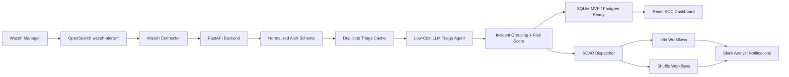

# AI SOC SOAR MVP

Low-cost AI SOC automation layer for Wazuh-first deployments, designed to become SIEM-agnostic.

## MVP Goal

Convert noisy SIEM alerts into prioritized, explainable incidents and trigger analyst-approved SOAR workflows through open-source automation.

## Current Build Status

- Day 1: Complete - market strategy, pain-point research, competitor scan, and MVP narrowing.
- Day 2: Complete - product plan plus backend foundation (DB/session, auth, JWT, RBAC, admin APIs, audit logs).
- Day 3: Complete - connector layer with persisted configs, health checks, encrypted secret path, connector history/audit, and live Wazuh/OpenSearch probe validation.
- Day 4: In progress - AI triage depth, analyst feedback, incident lifecycle, AI model settings, and threat-intel provider control plane.
- Day 5: In progress - alert queue filters, persisted correlation groups, local IOC enrichment, case lifecycle sections, executive metrics, and measurable noise-reduction evidence.
- Day 6: Demo-ready - n8n SOAR connector state, workflow template API, trigger API, persisted workflow run logs, frontend request console, and first high-impact approval hold.
- Day 7: Demo pack added - demo runbook, screenshot capture script, browser walkthrough, RBAC role editing, and judge-ready evidence checklist.

## Core Flow

1. Ingest Wazuh/OpenSearch alerts.
2. Normalize alerts into a SIEM-agnostic schema.
3. Enrich with asset, identity, threat intel, MITRE, and history context.
4. Use an LLM triage agent to classify and summarize.
5. Group related alerts into incidents.
6. Show analyst-ready context in the UI.
7. Trigger n8n/Shuffle workflows with approval and audit logging.

## High-Level Architecture Flow



### Architecture Principles

- Wazuh is the first connector, not a permanent dependency.
- Core logic consumes normalized alerts so Splunk, Sentinel, Elastic, QRadar, or EDR sources can be added later.
- AI triage returns structured JSON with verdict, confidence, evidence, risk score, and recommended actions.
- Repeated alerts should use cached triage to reduce token usage.
- Current SOAR foundation records workflow runs and audit events. Analyst-requested containment workflows are held as pending approval before destructive response actions.

## Cyber Authorization Boundaries

This project is defensive SOC tooling. The following activities require explicit owner approval before use on a live environment:

- Connecting to a production SIEM, Wazuh manager, OpenSearch cluster, or EDR source.
- Pulling, storing, exporting, or sharing real security logs and alert evidence.
- Sending client IOCs, hostnames, usernames, hashes, URLs, or IPs to external threat-intel or LLM providers.
- Triggering SOAR actions that change systems, such as blocking IPs, disabling users, isolating hosts, deleting files, or changing firewall rules.
- Running automation against third-party tools such as Jira, Slack, email, ticketing queues, n8n, Shuffle, or cloud APIs.

The default MVP design keeps dangerous actions behind RBAC, audit logs, masked secrets, and planned human approval gates.

## Repository Layout

```text
backend/          FastAPI backend
frontend/         React dashboard
codex-skills/     Project-specific Codex skills
data/             Demo Wazuh alerts and fixtures
docs/             Architecture and build notes
site/             7-day MVP progress website
soar/             n8n and Shuffle workflow templates
```

## Day 2 Planning Artifacts

- `docs/DAY2_PRODUCT_PLAN.md`: product wedge, target users, MVP boundaries, success metrics, and Day 3 readiness checklist.
- `docs/TECH_STACK.md`: low-cost stack choices and replaceability rules.
- `docs/BUILD_SEQUENCE.md`: day-wise implementation sequence from Wazuh ingestion to demo polish.
- `docs/CODEX_SKILLS.md`: project-local skill map for architecture, Wazuh, LLM triage, SOAR, and security.
- `GET /mvp/status`: backend endpoint that reports Day 2 completion and the next Day 3 build target.

## Day 3 Wazuh Pipeline Endpoints

- `GET /alerts/sample`: returns normalized demo Wazuh alerts plus summary counts.
- `GET /alerts/normalized`: returns normalized alert objects with pagination and SOC filters.
- `GET /api/v1/alerts`: returns persisted alerts with `limit`, `offset`, severity, rule, host, source IP, user, MITRE, and search filters.
- `POST /alerts/normalize`: converts one raw Wazuh alert into the normalized schema.
- `GET /alerts/wazuh/recent`: fetches recent alerts from OpenSearch when credentials are configured.

## Day 4 AI Triage Endpoints

- `POST /triage/alert`: triages one normalized alert and returns structured JSON.
- `GET /triage/sample`: triages all sample normalized alerts in batch mode.
- `GET /triage/noise-reduction`: returns raw alert count, suppressed noise, grouped duplicates, analyst item count, and reduction percentage.

## Day 4-5 Control Plane Endpoints

- `GET /api/v1/settings/ai-providers`: lists OpenAI, Anthropic, Ollama, and offline heuristic model settings with masked secrets.
- `PUT /api/v1/settings/ai-providers/{provider}`: admin-only update for model, cache, token limits, severity threshold, base URL, and API key.
- `POST /api/v1/settings/ai-providers/{provider}/health`: validates whether a provider is configured without exposing the secret.
- `GET /api/v1/settings/threat-intel`: lists VirusTotal, AbuseIPDB, OTX, MISP, and local IOC settings with masked secrets.
- `PUT /api/v1/settings/threat-intel/{provider}`: admin-only update for API key, base URL, daily limit, and enrichment cache TTL.
- `POST /api/v1/settings/threat-intel/{provider}/health`: validates threat-intel configuration state.
- `GET /api/v1/threat-intel/local-iocs`: lists lab-local IOC watchlist entries.
- `POST /api/v1/threat-intel/local-iocs`: creates or updates a local IOC.
- `GET /api/v1/threat-intel/enrich-alert/{alert_id}`: matches a stored alert against local IOCs without external API calls.

## Day 6-7 SOAR, Demo, and Admin Controls

- `GET /api/v1/automation/connectors`: returns n8n connector status and masked webhook state.
- `GET /api/v1/automation/workflow-templates`: lists available workflow templates.
- `POST /api/v1/automation/workflow-templates/{template_id}/trigger`: requests a workflow run with case and alert context.
- `GET /api/v1/automation/workflow-runs`: shows persisted workflow history, including pending approvals.
- `POST /api/v1/automation/workflow-runs/{run_id}/approve`: admin approval/reject path for high-impact workflow requests.
- `PATCH /api/v1/auth/users/{user_id}/role`: admin-only role assignment for `admin`, `analyst`, or `viewer`, with self-demotion blocked.
- Demo runbook: `docs/DAY7_DEMO_RUNBOOK.md`.
- Browser walkthrough: `demo/video/demo-flow.html`.
- Screenshot capture script: `scripts/capture_demo_screenshots.mjs`.

## 7-Day Build Plan

- Day 1: Market strategy, competitor/product scan, industry pain-point research, startup positioning, and focused MVP idea selection.
- Day 2: Product plan, high-level architecture, technology stack, Codex skills, repository setup, and build sequence.
- Day 3: Wazuh deployment path, OpenSearch connectivity, sample alert fetch, normalization/fine-tuning, and MVP dashboard alert display.
- Day 4: AI triage endpoints with signal/noise scoring, correlation, queue routing, suppression reason, confidence, evidence, MITRE context, risk scoring, cache replay, and BYO model settings.
- Day 5: Incident grouping, threat-intel enrichment, risk scoring aggregation, duplicate/noise feedback, and measurable alert-reduction metrics.
- Day 6: n8n/Shuffle SOAR workflow triggers, Slack notifications, approval controls, and analyst UI.
- Day 7: Demo polish, security review, before/after pitch metrics, dashboard screenshots, RBAC role editing, walkthrough flow, and judge-ready story.

## Low-Cost AI Strategy

The MVP uses a Cheap Cloud strategy instead of fine-tuning. The default path is
a small useful cloud model, strict input size, JSON-only output, cached duplicate
triage, and fallback escalation for unclear alerts. Stronger models should be
reserved only for demo-critical or high-severity summaries when required.

## Development

Backend and frontend commands will be added as the implementation is built.
