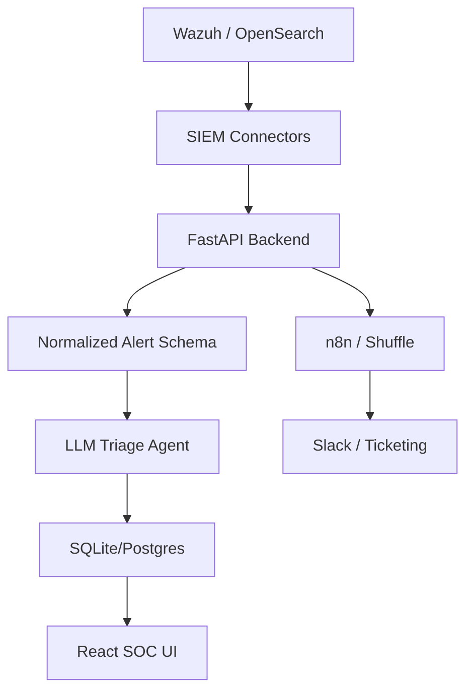

# Architecture

## Product Positioning

The MVP is an AI alert-noise reduction and SOAR trigger layer. It starts with Wazuh because Wazuh is open source and demo-friendly, but all internal logic uses a normalized alert schema so future Splunk, Sentinel, Elastic, QRadar, and EDR connectors can be added without rewriting the agent.

## Logical Components

## MVP Modules

- `connectors`: SIEM/source-specific ingestion.
- `models`: normalized alert, triage decision, incident, SOAR action schemas.
- `agents`: LLM prompt construction and structured output validation.
- `services`: triage, incident grouping, SOAR dispatch, metrics.
- `api`: FastAPI route definitions.
- `db`: persistence and migrations.

## Design Guardrails

- Keep Wazuh-specific logic inside the Wazuh connector.
- Store raw alert separately from normalized fields.
- Never let raw log text directly control SOAR actions.
- Require analyst approval for response actions in MVP.
- Every AI decision should include evidence and confidence.
